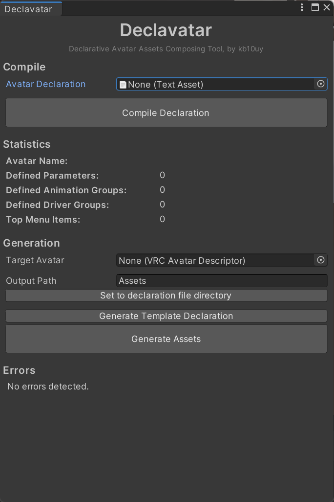

# Declavatar の使い方

## 準備
1. Animator as Code をプロジェクトに導入する。
    - [Booth リンク](https://booth.pm/ja/items/3700542)
    - [Github: hai-vr/av3-animator-as-code](https://github.com/hai-vr/av3-animator-as-code)
2. Declavatar をプロジェクトに導入する。
    - [Releases](https://github.com/kb10uy/declavatar/releases)

## 手順

1. アバター定義ファイルを作成し、Unity プロジェクトにインポートする。
2. `Window > Declavatar` から Declavatar のウィンドウを開く。
3. `Avatar Declaration` の欄に 1. でインポートしたアバター定義ファイルを設定して `Compile Declaration` を実行する。
4. 定義ファイルに問題がなければ `Statistics` 欄に各種定義数が表示される。また、エラーが発生した場合は下部に表示される。
5. アセットの生成対象にしたいアバターのルートのオブジェクトを `Target Avatar` に指定する。
6. `Output Path` にアセットの生成先パスを指定する。`Set to declaration file directory` で定義ファイルのパスが指定される。
7. `Generate Assets` を実行してアセットを生成する。
